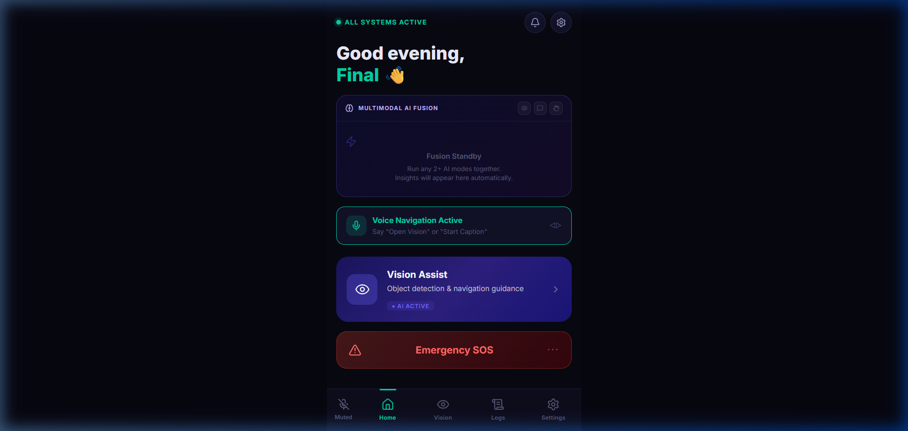
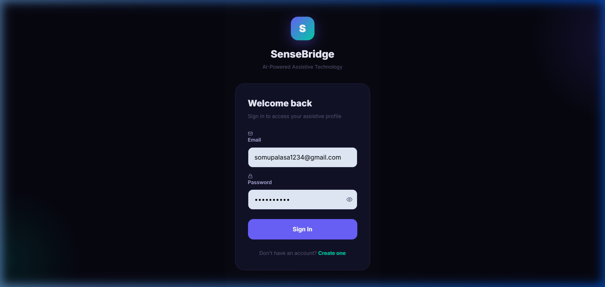
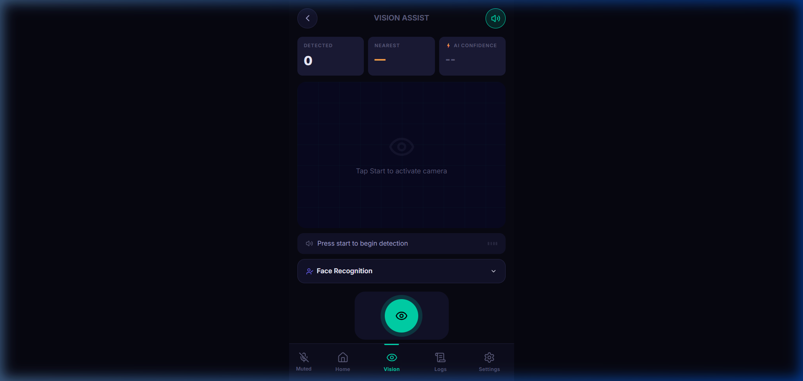
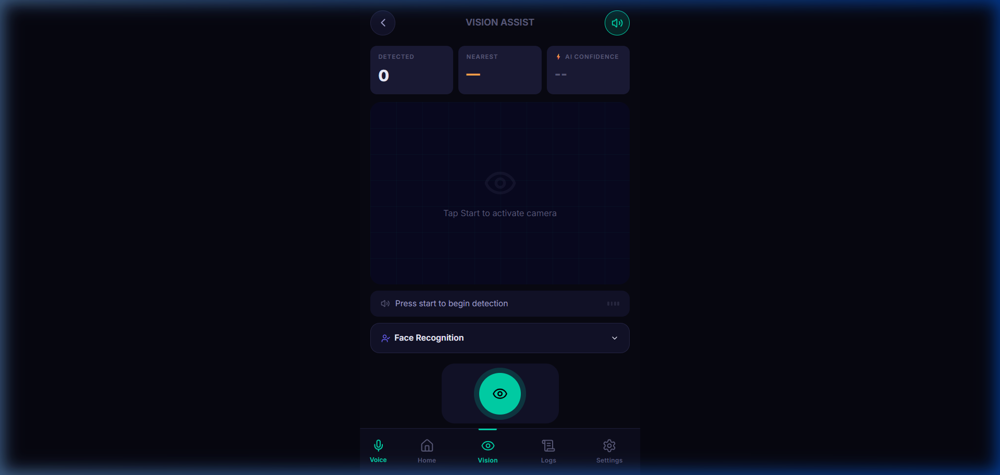
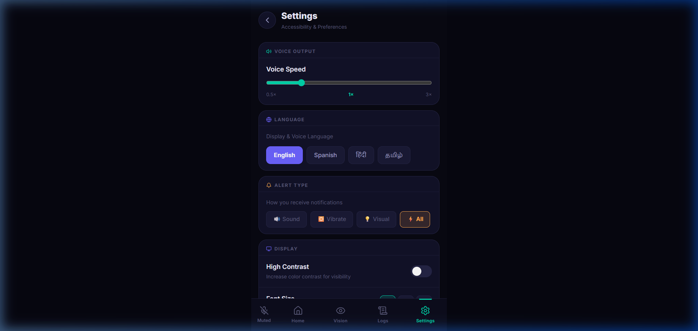
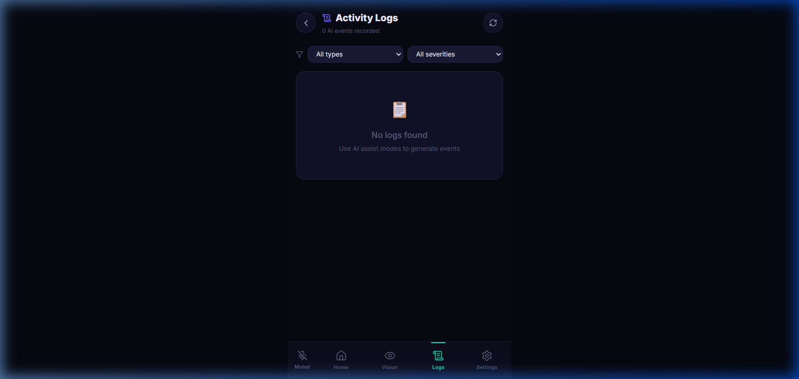

<p align="center">
  
</p>

<h1 align="center">🌉 SenseBridge </h1>
<h3 align="center">AI-Powered Assistive Technology for the Differently Abled</h3>

<p align="center">
  <strong>Real-time object detection • Voice alerts • Gesture recognition • Speech-to-text</strong>
</p>

<p align="center">
  
  
  
  
  
</p>

---

## 📖 Problem Statement

Over **2.2 billion** people worldwide live with some form of visual, hearing, or speech impairment. Existing assistive technologies are often **expensive, fragmented, or inaccessible** to users in developing countries. SenseBridge aims to bridge this gap by providing an **all-in-one AI-powered assistive platform** that works on affordable smartphones and web browsers.

SenseBridge provides **real-time environmental awareness** through:
- 🔍 Object detection with voice feedback ("Person ahead", "Chair on your left")
- 🗣️ Speech-to-text transcription for hearing-impaired users
- ✋ Gesture recognition to convert sign language into text/speech
- 🧠 Multimodal AI fusion that combines all senses into unified alerts

---

## ✨ Features

| Feature | Description | Technology |
|---|---|---|
| 👁️ **Vision Assist** | Real-time object detection with 80+ COCO classes, positional awareness (left/center/right), distance estimation | YOLOv8, COCO-SSD, TensorFlow.js |
| 🗣️ **Speech Assist** | Live speech-to-text transcription with multi-language support | Web Speech API, Whisper |
| ✋ **Gesture Recognition** | 10+ hand gesture classification with angle-vector analysis | MediaPipe Hands, LSTM |
| 🔔 **Smart Alerts** | Priority-based voice/vibration alerts with cooldown to prevent spam | pyttsx3, Web Speech Synthesis |
| 🧠 **Multimodal Fusion** | Combines object + speech + gesture + OCR into a single decision | Custom Fusion Engine |
| 🔊 **Positional Audio** | "Person ahead", "Car on your right", "Chair on your left" | Custom voice alert pipeline |
| 🆘 **Emergency SOS** | One-tap emergency alert with location sharing via email | Nodemailer, Geolocation API |
| 👤 **Face Recognition** | Identify known faces and provide audio cues | face-api.js |
| 📊 **Activity Logs** | Track detection history, speech transcripts, and events | MongoDB Atlas |
| ⚡ **Edge AI** | All AI runs on-device (browser WebGL or Python ONNX) — no cloud dependency | ONNX Runtime, WebGL |

---

## 📸 Screenshots

### 🔐 Login & Registration
<p align="center">
  
</p>

### 🏠 Dashboard
<p align="center">
  
</p>

### 👁️ Vision Assist (Object Detection)
<p align="center">
  
</p>

### 🗣️ Speech Assist
<p align="center">
  
</p>

### ⚙️ Settings
<p align="center">
  
</p>

### 📊 Activity Logs
<p align="center">
  
</p>

---

## 🏗️ Architecture

```
┌──────────────────────────────────────────────────────────────┐
│                    SenseBridge Platform                       │
├──────────────┬──────────────────┬────────────────────────────┤
│   Frontend   │     Backend      │        AI Engine           │
│  (React+Vite)│  (Node/Express)  │    (Python/Flask)          │
│  Port: 5173  │   Port: 5000     │     Port: 8000             │
├──────────────┼──────────────────┼────────────────────────────┤
│ • COCO-SSD   │ • Auth (JWT)     │ • YOLOv8 (80 COCO classes)│
│ • MediaPipe  │ • MongoDB Atlas  │ • Whisper STT              │
│ • face-api.js│ • REST API       │ • EasyOCR                  │
│ • TF.js WebGL│ • Email (SOS)    │ • Gesture LSTM             │
│ • TailwindCSS│ • Gemini AI      │ • Fusion Engine            │
│   v4         │                  │ • Distance Estimator       │
└──────────────┴──────────────────┴────────────────────────────┘
```

---

## 🛠️ Tech Stack

### Frontend
- **React 18** + **Vite 6** — fast SPA with HMR
- **TailwindCSS v4** — utility-first styling
- **TensorFlow.js** — browser-based object detection (COCO-SSD mobilenet_v2)
- **MediaPipe Hands** — real-time gesture recognition
- **face-api.js** — face detection & recognition
- **Web Speech API** — speech-to-text + text-to-speech
- **Capacitor** — native Android/iOS deployment

### Backend
- **Node.js + Express** — REST API server
- **MongoDB Atlas** — cloud database
- **JWT** — authentication
- **Nodemailer** — emergency SOS email alerts
- **Gemini API** — AI-powered sentence formation

### AI Engine (Python)
- **YOLOv8 (Ultralytics)** — object detection (80 COCO classes)
- **ONNX Runtime** — optimized edge inference
- **OpenAI Whisper** — speech-to-text
- **EasyOCR / PaddleOCR** — text recognition
- **MediaPipe + LSTM** — gesture classification
- **pyttsx3** — offline text-to-speech
- **Flask** — REST API for AI modules
- **OpenCV** — video/image processing

---

## 🎯 Object Detection — What Was Fixed

### Problem
The system was only detecting **"person"** because it used a **custom-trained model** (`sensebridge_yolov8n.pt`) with only **12 classes**. The confidence threshold was set too high (0.45), and there was no class-name mapping for COCO classes.

### Solution

| What Changed | Before | After |
|---|---|---|
| **Class support** | 12 custom classes | 80 COCO classes + 12 custom |
| **Confidence threshold** | 0.45 (too restrictive) | 0.30 (detects more objects) |
| **Model fallback** | Crash if custom model missing | Auto-fallback to pretrained `yolov8n.pt` |
| **Positional awareness** | None | Left / Center / Right detection |
| **Voice alerts** | Generic "detected" | "Person ahead", "Chair on your left" |
| **Important class filter** | None | 40+ important classes for blind users |
| **Duplicate prevention** | None | Same label+position deduplication |

### Example Voice Alerts
```
🔊 "Person ahead"
🔊 "Chair on your left"
🔊 "Car on your right"
🔊 "Dog ahead"
🔊 "Bottle on your left"
🔊 "Stairs ahead"
```

---

## 🚀 Installation & Setup

### Prerequisites
- **Node.js** 20.x or higher
- **Python** 3.10 or higher
- **Git**
- **MongoDB Atlas** account (or local MongoDB)

### 1️⃣ Clone the Repository
```bash
git clone https://github.com/your-repo/SenseBridge.git
cd SenseBridge
```

### 2️⃣ Backend Setup
```bash
cd sensebridge-backend

# Install dependencies
npm install

# Create .env file (copy from example or use these values)
# Required variables:
#   PORT=5000
#   MONGO_URI=mongodb+srv://...
#   JWT_SECRET=your_secret_key
#   JWT_EXPIRES_IN=7d
#   ALLOWED_ORIGINS=http://localhost:3000,http://localhost:5173,http://localhost:5174

# Start the backend
node server.js
```
✅ You should see: `🚀 SenseBridge API running on port 5000`

### 3️⃣ Frontend Setup
```bash
cd sensebridge-frontend

# Install dependencies
npm install

# Start the development server
npm run dev
# OR: npx vite --port 5173
```
✅ You should see: `VITE v6.x ready — http://localhost:5173/`

### 4️⃣ AI Engine Setup (Optional — for Python AI modules)
```bash
cd sensebridge-ai

# Install Python dependencies
pip install flask flask-cors flask-limiter python-dotenv

# For full AI capabilities (object detection, STT, OCR):
pip install -r requirements.txt

# Start the AI server
python -m api.app
```
✅ You should see: `SenseBridge AI server on 0.0.0.0:8000`

---

## ▶️ Running the Project

Open **3 terminals** and run:

| Terminal | Command | Port |
|---|---|---|
| 1 — Backend | `cd sensebridge-backend && node server.js` | 5000 |
| 2 — Frontend | `cd sensebridge-frontend && npm run dev` | 5173 |
| 3 — AI Engine | `cd sensebridge-ai && python -m api.app` | 8000 |

Then open: **http://localhost:5173** in your browser.

### Running Object Detection (Python standalone)
```bash
cd sensebridge-ai
python -m modules.object_detection.detect
# Opens webcam with real-time detection, voice alerts, and bounding boxes
# Press Q to quit
```

---

## 📁 Project Structure

```
Sense-Bridge/
├── sensebridge-frontend/       # React + Vite frontend
│   ├── src/
│   │   ├── pages/              # VisionAssist, SpeechAssist, Gesture, etc.
│   │   ├── services/           # aiService.js (COCO-SSD, MediaPipe, TTS)
│   │   ├── context/            # AuthContext, ThemeContext
│   │   └── layouts/            # AppLayout, AuthLayout
│   ├── package.json
│   └── vite.config.js
│
├── sensebridge-backend/        # Node.js + Express API
│   ├── controllers/            # Auth, AI, Logs, Emergency
│   ├── models/                 # User, Log, EmergencyContact
│   ├── routes/                 # API route definitions
│   ├── server.js               # Entry point
│   └── .env                    # Environment variables
│
├── sensebridge-ai/             # Python AI Engine
│   ├── api/
│   │   ├── app.py              # Flask application
│   │   └── routes/             # detection, ocr, stt, gesture, fusion
│   ├── modules/
│   │   ├── object_detection/   # YOLOv8 + distance + tracker
│   │   ├── ocr/                # EasyOCR / PaddleOCR
│   │   ├── stt/                # Whisper engine
│   │   ├── gesture/            # LSTM gesture recognizer
│   │   ├── fusion/             # Multimodal fusion engine
│   │   └── output/             # Alert manager + TTS
│   ├── requirements.txt
│   └── .env
│
├── screenshots/                # App screenshots for README
└── README.md                   # This file
```

---

## 🧪 API Endpoints

### Backend (Port 5000)
| Method | Endpoint | Description |
|---|---|---|
| POST | `/api/auth/register` | Register new user |
| POST | `/api/auth/login` | Login & get JWT token |
| GET | `/api/auth/me` | Get current user profile |
| POST | `/api/ai/format-sentence` | Gemini-powered sentence formation |
| GET | `/api/logs` | Get activity logs |
| POST | `/api/emergency/sos` | Trigger emergency SOS alert |

### AI Engine (Port 8000)
| Method | Endpoint | Description |
|---|---|---|
| GET | `/health` | Health check |
| POST | `/api/detect` | Object detection (image → detections) |
| POST | `/api/ocr` | OCR text extraction |
| POST | `/api/stt/transcribe` | Speech-to-text (audio file) |
| POST | `/api/gesture/predict` | Gesture classification |
| POST | `/api/fuse` | Multimodal fusion decision |

---

## 🔮 Future Improvements

- [ ] **Indoor Navigation** — AR-based path guidance using ARCore/ARKit
- [ ] **Offline Mode** — Full ONNX inference without internet
- [ ] **Multi-language TTS** — Hindi, Tamil, Telugu voice alerts
- [ ] **Wearable Integration** — Smart glasses / bone conduction audio
- [ ] **Community Mode** — Connect blind users with volunteer helpers
- [ ] **Custom Model Training** — Fine-tune on Indian road objects
- [ ] **Battery Optimization** — Reduce power usage for mobile deployment

---

## 👥 Team

| Name | Role |
|---|---|
| **Subha Dhanush Pasala** | Full Stack Developer & AI Engineer |
| **Somu Palasa** | Frontend Developer & AI/ML Engineer |
| **Rohan Chowdary** | UI/UX Designer & Researcher |
| **Tejaswini** | Backend Developer & Testing |

---

## 📄 License

This project is developed for academic and research purposes. See [LICENSE](LICENSE) for details.

---

<p align="center">
  <strong>🌉 SenseBridge — Making the world more accessible, one sense at a time.</strong>
</p>
